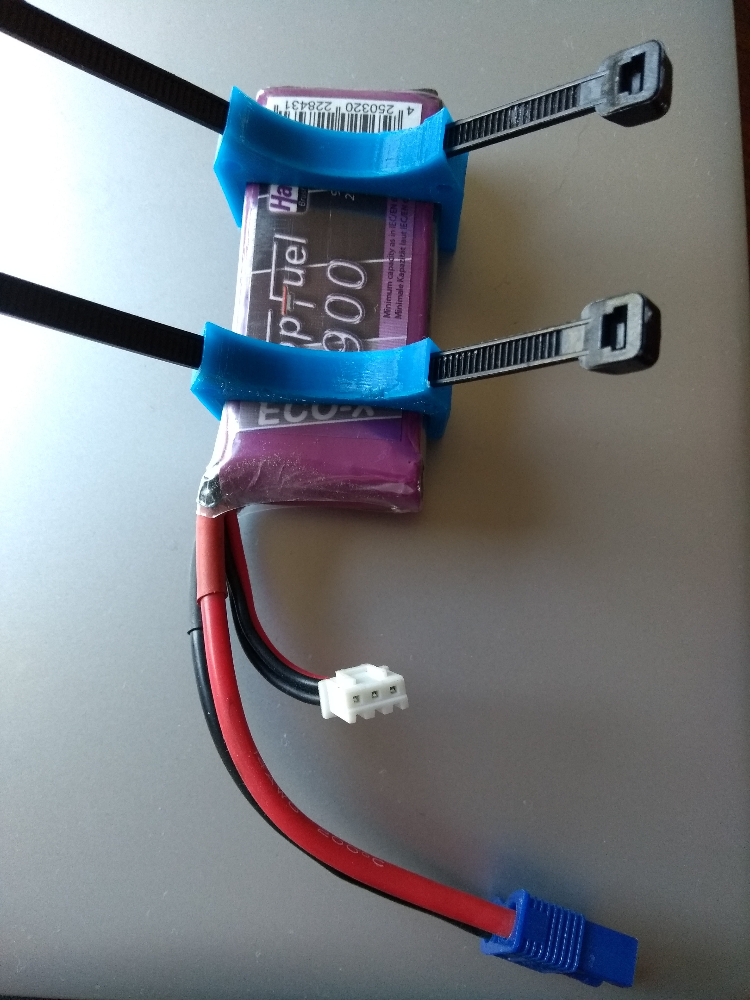
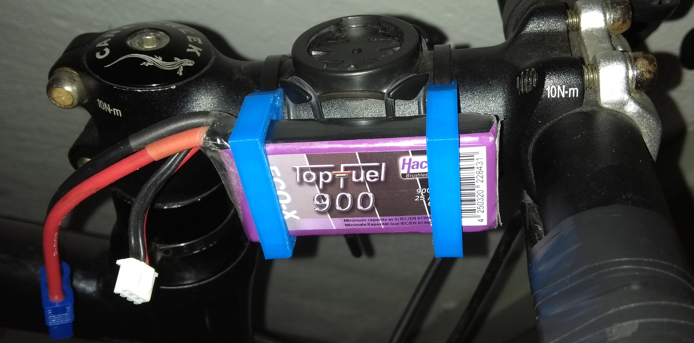

Battery Clip
============
As discussed [lipo batteries serve pretty well as energy source for BUM Ixon IQs.](http://carloscologne.de/pimp_bum_ixon.html).
Instead of using a velcro strap, this clip can be printed twice and used to push the battery in. 

You can customize the following Openscad design to match your bikes stem or top-tube, the straps you want to use, or even fit different batteries: 

Here we have the batter, with two clips attached to it, with straps filled in:

To avoid conflicts with brake cables, this pair is mounted at the side of the stem:

