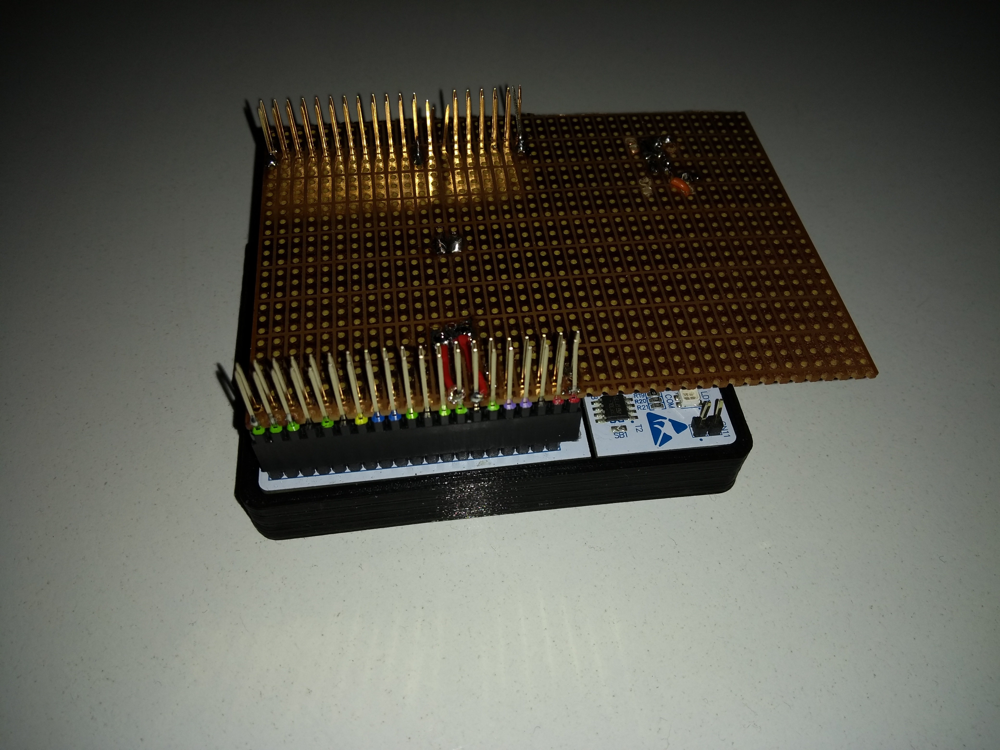
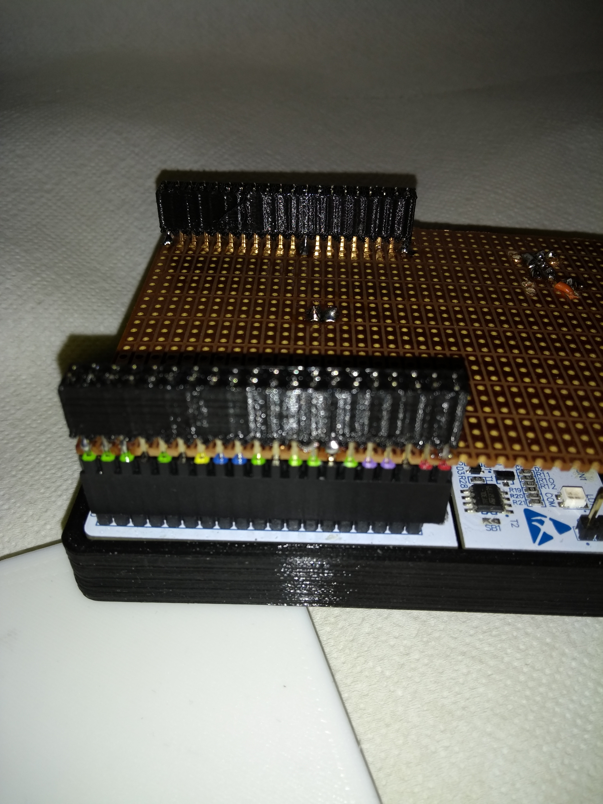

Precious Pins Protecor
======================
Ever having pins bent on your Pin-Headers?

Along comes the pin protector, a dummy plug you can plug onto the pins:

The default comes in 2x20 pins like i.e. the Raspii has.

The pin header I've got is pretty thin. You may want to edit the SCad file according to your needs - Pin Rows and number of pins per rows are parametrizeable.
